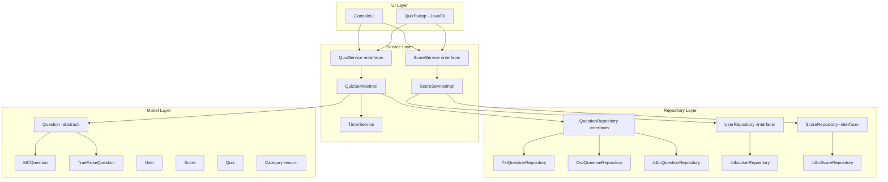
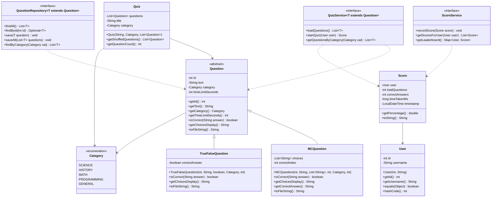
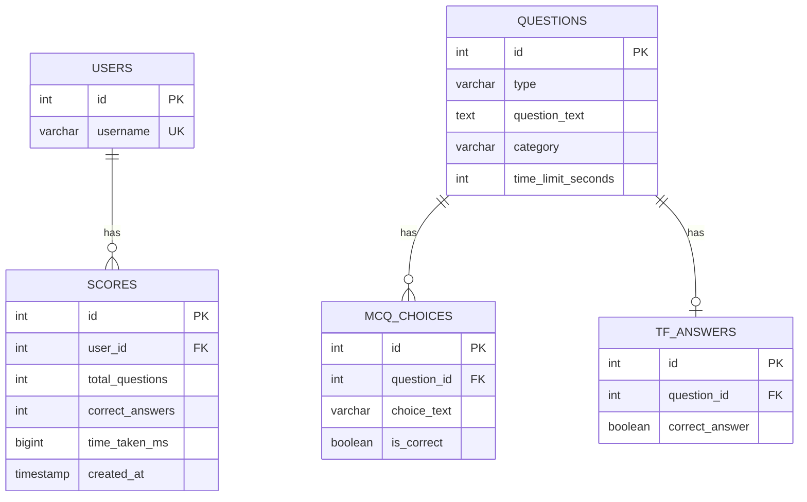

# 🎯 Interactive Quiz System — Implementation Plan

A complete Java project following clean layered architecture, OOP best practices, generics, file & database persistence, and a JavaFX GUI.

---

## 1. Architecture Overview



---

## 2. Class Diagram



---

## 3. Database Schema (ERD)



---

## 4. Project Structure

```
d:\Quiz Game\
├── src\
│   └── com\
│       └── quizsystem\
│           ├── model\
│           │   ├── Question.java          (abstract base)
│           │   ├── MCQuestion.java         (multiple-choice)
│           │   ├── TrueFalseQuestion.java  (true/false)
│           │   ├── User.java
│           │   ├── Score.java
│           │   ├── Quiz.java
│           │   └── Category.java           (enum)
│           ├── service\
│           │   ├── QuizService.java        (generic interface)
│           │   ├── QuizServiceImpl.java
│           │   ├── ScoreService.java       (interface)
│           │   ├── ScoreServiceImpl.java
│           │   └── TimerService.java
│           ├── repository\
│           │   ├── QuestionRepository.java (generic interface)
│           │   ├── TxtQuestionRepository.java
│           │   ├── CsvQuestionRepository.java
│           │   ├── JdbcQuestionRepository.java
│           │   ├── UserRepository.java     (interface)
│           │   ├── JdbcUserRepository.java
│           │   ├── ScoreRepository.java    (interface)
│           │   └── JdbcScoreRepository.java
│           ├── ui\
│           │   ├── ConsoleUI.java          (CLI interface)
│           │   └── QuizFxApp.java          (JavaFX GUI)
│           ├── util\
│           │   └── DatabaseConnection.java (JDBC singleton)
│           └── Main.java                   (entry point)
├── data\
│   ├── questions.txt
│   └── questions.csv
├── sql\
│   └── schema.sql
├── lib\
│   └── (JDBC driver JAR if needed)
├── compile.bat
├── run.bat
└── README.md
```

---

## 5. Proposed Changes — File by File

### Model Layer

#### [NEW] Question.java
- Abstract class with fields: `id`, `text`, `category`, `timeLimitSeconds`
- Abstract methods: `isCorrect(String)`, `getChoicesDisplay()`, `toFileString()`
- Demonstrates **abstraction** and **encapsulation**

#### [NEW] MCQuestion.java
- Extends `Question` — stores `List<String> choices` and `int correctIndex`
- Overrides abstract methods — demonstrates **inheritance** and **polymorphism**

#### [NEW] TrueFalseQuestion.java
- Extends `Question` — stores `boolean correctAnswer`
- Alternative question type showing polymorphism in action

#### [NEW] User.java
- Simple POJO with `id` and `username`
- Overrides `equals()` and `hashCode()` for use as `Map` key

#### [NEW] Score.java
- Tracks `user`, `totalQuestions`, `correctAnswers`, `timeTakenMs`, `timestamp`
- `getPercentage()` utility method

#### [NEW] Quiz.java
- Aggregates a list of questions with a title and category
- `getShuffledQuestions()` — uses `Collections.shuffle()` for randomization

#### [NEW] Category.java
- Enum: `SCIENCE`, `HISTORY`, `MATH`, `PROGRAMMING`, `GENERAL`

---

### Repository Layer

#### [NEW] QuestionRepository.java
- Generic interface: `QuestionRepository<T extends Question>`
- Methods: `findAll()`, `findById()`, `save()`, `saveAll()`, `findByCategory()`

#### [NEW] TxtQuestionRepository.java
- Reads/writes questions to `data/questions.txt` using `BufferedReader`/`BufferedWriter`
- Custom delimited format: `TYPE|ID|TEXT|CATEGORY|TIME|CHOICES|CORRECT`

#### [NEW] CsvQuestionRepository.java
- Reads/writes questions to `data/questions.csv`
- Standard CSV with header row
- Handles escaping commas in question text

#### [NEW] JdbcQuestionRepository.java
- Full CRUD via JDBC `PreparedStatement`
- Uses `DatabaseConnection` singleton for connection management

#### [NEW] UserRepository.java / JdbcUserRepository.java
- Interface + JDBC implementation for user persistence

#### [NEW] ScoreRepository.java / JdbcScoreRepository.java
- Interface + JDBC implementation for score persistence

---

### Service Layer

#### [NEW] QuizService.java
- Generic interface: `QuizService<T extends Question>`
- Methods: `loadQuestions()`, `startQuiz(User)`, `getQuestionsByCategory(Category)`

#### [NEW] QuizServiceImpl.java
- Core quiz logic: load questions, filter by category, run quiz, calculate score
- Delegates persistence to repository layer

#### [NEW] ScoreService.java / ScoreServiceImpl.java
- Score recording and leaderboard generation
- `getLeaderboard()` returns `Map<User, Score>`

#### [NEW] TimerService.java
- Per-question countdown timer using `ScheduledExecutorService`
- Callbacks for time-up events

---

### UI Layer

#### [NEW] ConsoleUI.java
- Full console-based quiz experience with `Scanner`
- Menu: Create Quiz, Take Quiz, View Scores, Manage Questions
- Colored console output where supported

#### [NEW] QuizFxApp.java
- JavaFX Application with scenes:
  - **Welcome** — username entry + category selection
  - **Quiz** — question display, choices (radio buttons), timer bar
  - **Results** — score summary, leaderboard table

---

### Utility

#### [NEW] DatabaseConnection.java
- Singleton pattern for JDBC connection
- Uses SQLite (zero-config, file-based — no server needed)
- Auto-creates tables on first run

---

### Data Files

#### [NEW] data/questions.txt
- 15+ sample questions across all categories in pipe-delimited format

#### [NEW] data/questions.csv
- Same questions in CSV format with header row

#### [NEW] sql/schema.sql
- DDL statements for all tables (SQLite syntax)

---

### Build & Run

#### [NEW] compile.bat
- Compiles all `.java` files with classpath setup

#### [NEW] run.bat
- Runs `Main` class with correct classpath

#### [NEW] README.md
- Setup instructions, architecture explanation, improvement suggestions

---

## 6. Key Design Decisions

| Decision | Rationale |
|---|---|
| **SQLite over MySQL/PostgreSQL** | Zero configuration — just a `.jar` file. Perfect for a learning project. |
| **Generic interfaces** | `QuestionRepository<T extends Question>` shows bounded type parameters in practice |
| **Repository pattern** | Cleanly separates data access from business logic. Easy to swap file ↔ DB storage |
| **Abstract `Question` class** | Enables polymorphism — `MCQuestion` and `TrueFalseQuestion` share a common API |
| **Enum for Category** | Type-safe, prevents invalid categories, easy to extend |
| **Singleton DB connection** | Simple resource management; appropriate for this project's scope |
| **Console + JavaFX** | Console-first for easy testing; JavaFX as a bonus polished UI |

---

## 7. Open Questions

> [!IMPORTANT]
> **JavaFX Availability**: JavaFX was removed from the JDK starting with Java 11. Do you have JavaFX SDK installed, or would you prefer I use **Swing** instead? (The console UI works regardless.)

> [!NOTE]
> **Database**: I'll use **SQLite** (via `sqlite-jdbc` JAR) so there's no need to install a database server. The database file will live at `data/quiz.db`. Is that acceptable?

> [!NOTE]
> **Build System**: I'll provide simple `compile.bat` and `run.bat` scripts. Would you prefer a **Maven** or **Gradle** project instead?

---

## 8. Verification Plan

### Automated Tests
- Compile all source files and verify zero errors
- Run the console UI end-to-end: create user → take quiz → view scores
- Verify `.txt` and `.csv` file read/write (data survives restart)
- Verify SQLite DB creation and CRUD operations

### Manual Verification
- Demonstrate full console session with sample output
- Launch JavaFX GUI (if available) and walk through quiz flow
- Verify question randomization produces different ordering
- Verify timer functionality (question auto-skips on timeout)

---

## 9. Suggested Improvements (Post-MVP)

1. **Difficulty levels** — Easy/Medium/Hard with weighted scoring
2. **Multi-player mode** — Competitive quiz sessions
3. **REST API** — Spring Boot backend for web-based quizzes
4. **Question import** — Load questions from JSON/XML
5. **Analytics** — Track which categories a user struggles with
6. **Sound effects** — Audio feedback for correct/incorrect answers in JavaFX
7. **Internationalization (i18n)** — Support multiple languages
